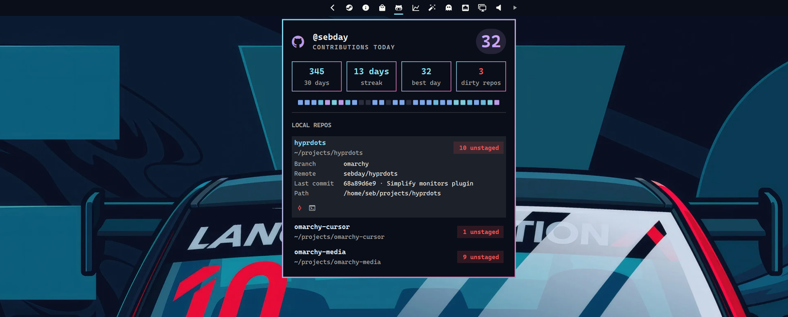

# Omarchy GitHub plugin



Bar widget for GitHub contributions: today's count, 30-day stats, an activity trends chart, and local dirty repos under `~/projects` and `~/work`.

## Install

```bash
omarchy plugin add https://github.com/sebday/omarchy-github.git
omarchy plugin enable evo.github
```

A local path works the same way. Plugins run as unsandboxed code inside `omarchy-shell`. Review the files before enabling.

## Requirements

- `curl`, `jq`, and `bash` on `PATH`
- GitHub auth via `gh`, a session token, or `pass` (see below)

## Auth

The bar process does not see tokens exported from your interactive shell. Resolution order:

1. `GITHUB_TOKEN` if the Omarchy session already has it (Hyprland env or `~/.config/environment.d/`)
2. `gh auth token` when the GitHub CLI is installed and logged in
3. `pass` at `omarchy/github/token`

```bash
# Easiest: sign in with the GitHub CLI (gh must be on PATH for the bar)
gh auth login

# Optional session override for the bar
echo 'GITHUB_TOKEN=ghp_...' > ~/.config/environment.d/github.conf

# Optional pass fallback
pass insert omarchy/github/token
```

## Settings

```bash
omarchy bar set evo.github refreshMinutes 15 --json
```

| Key | Default | What it does |
|---|---|---|
| `refreshMinutes` | `15` | Background refresh interval for contributions and repos |

## IPC

```bash
omarchy-shell evo.github toggle
omarchy-shell evo.github refresh
omarchy-shell shell toggle evo.github
```

| Call | Action |
|---|---|
| `open` / `show` | Open the panel |
| `close` / `hide` | Close the panel |
| `toggle` | Toggle the panel |
| `refresh` | Refresh contributions and repos |
